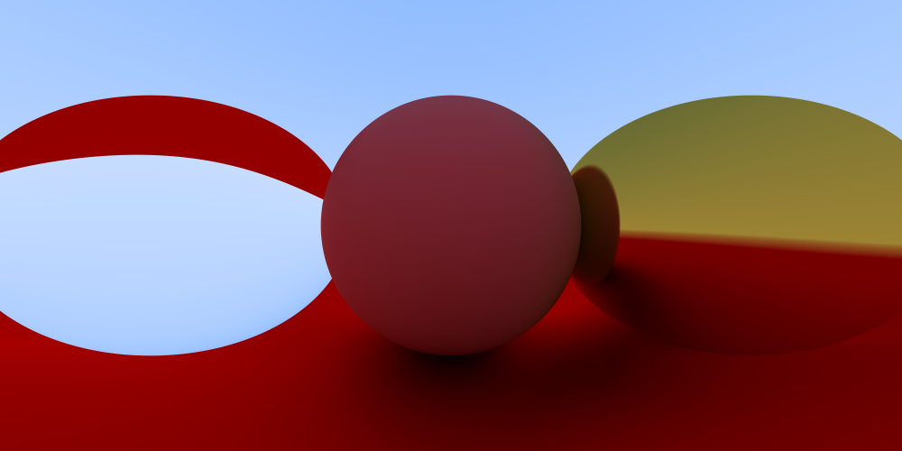
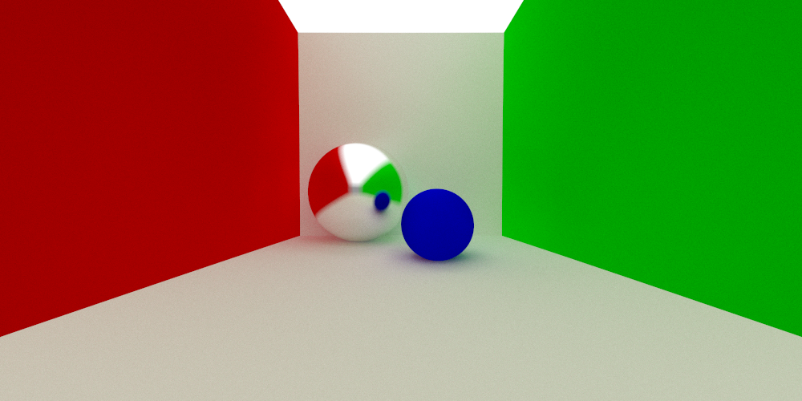

# 一个简单的光线追踪渲染器
不依赖第三方库，输出图片为.ppm格式
## 运行程序
切换到当前目录下，输入
```cmd
mkdir build
cd build
cmake ..
make
./Render <参数>
```
<参数>为每像素采样次数，效果图为采样10000次时生成的图像。建议输入10--100之间的数字以在画质和渲染时间中取得平衡，缺省值为10
## 效果


## 加速结构
维护一个异步线程池，进行高效渲染

## 参考
- https://www.bilibili.com/read/cv8996679
- https://forum.taichi-lang.cn/t/homework-0/756
- https://www.bilibili.com/video/BV1N8411h7hK/
